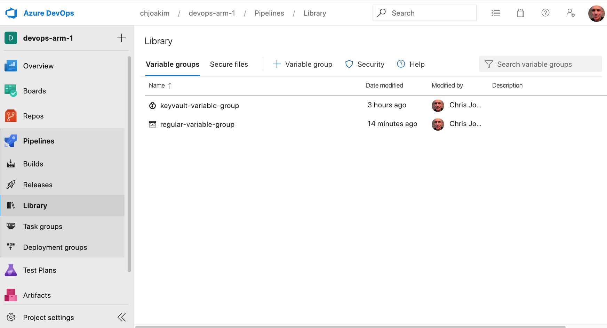
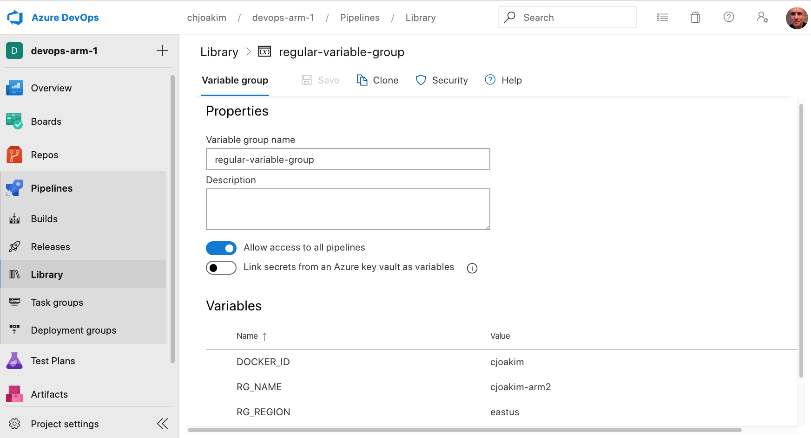
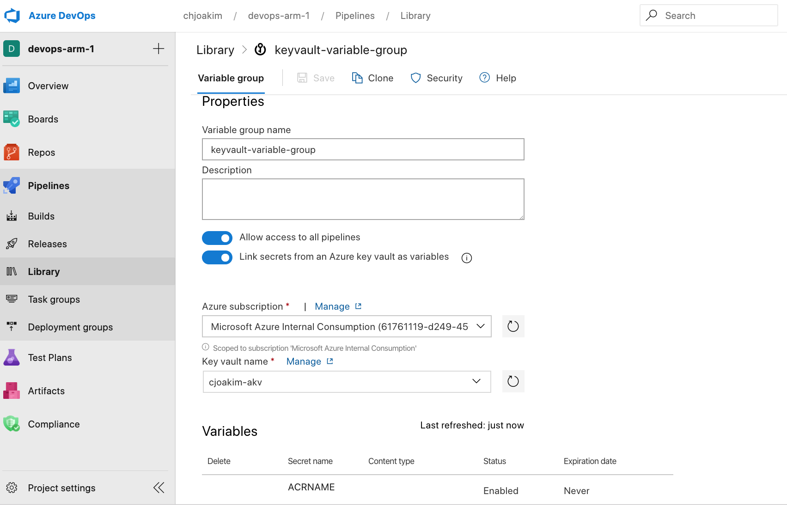
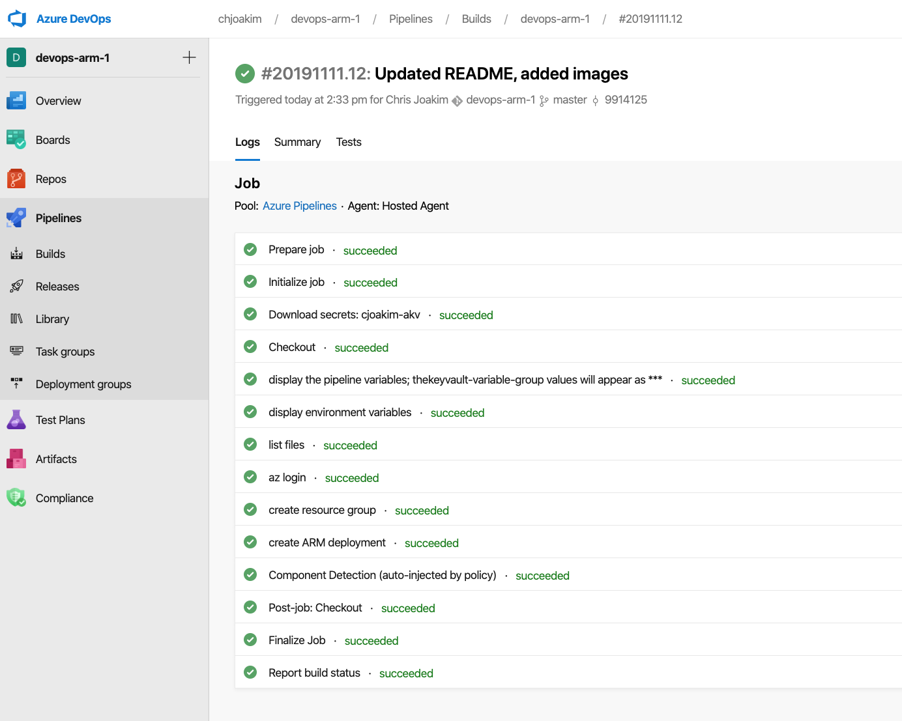
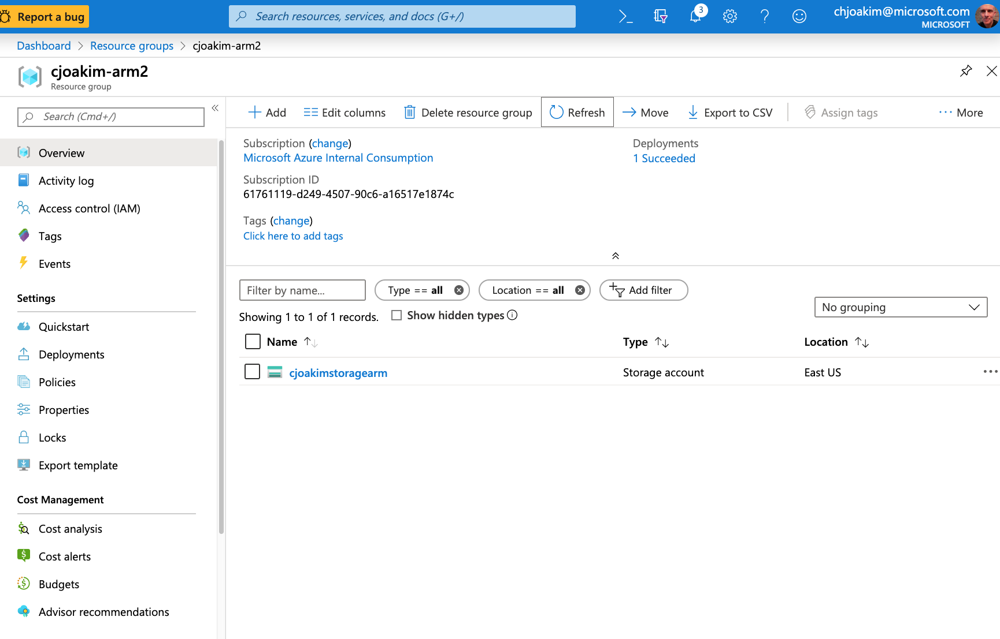

# devops-arm-1

An example of deploying Azure ARM templates in Azure DevOps,
using Azure KeyVault.

## Links

- https://docs.microsoft.com/en-us/azure/azure-resource-manager/vs-resource-groups-project-devops-pipelines

- https://docs.microsoft.com/en-us/azure/azure-resource-manager/resource-manager-tutorial-use-azure-pipelines

- https://docs.microsoft.com/en-us/cli/azure/create-an-azure-service-principal-azure-cli?view=azure-cli-latest

---

## Main Files

- [create-service-principal.sh](create-service-principal.sh)
- [akv-secrets.sh](akv-secrets.sh)
- [storage-template.json](storage-template.json)
- [storage-parameters.json](storage-parameters.json)
- [azure-pipelines.yml](azure-pipelines.yml)

---

## Screen Shots

### List of Variable Groups 

---

### Regular Variable Group

---

### Key Vault Variable Group

---

### Successful Pipeline Build

---

### Deployed Resources in Azure Portal

---